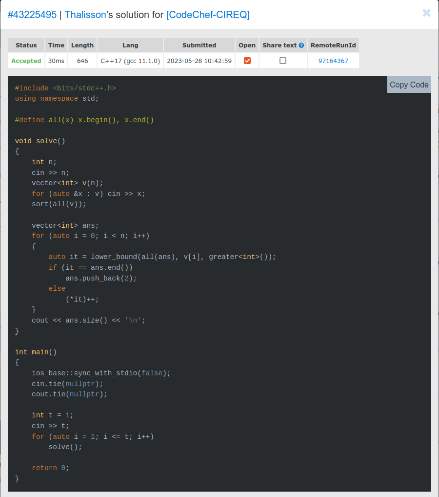
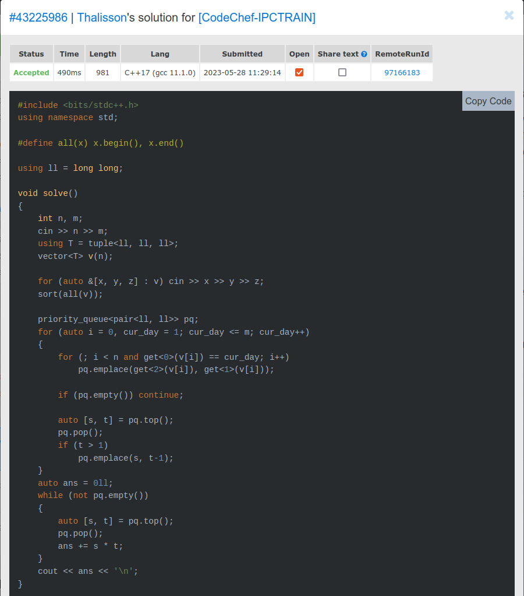
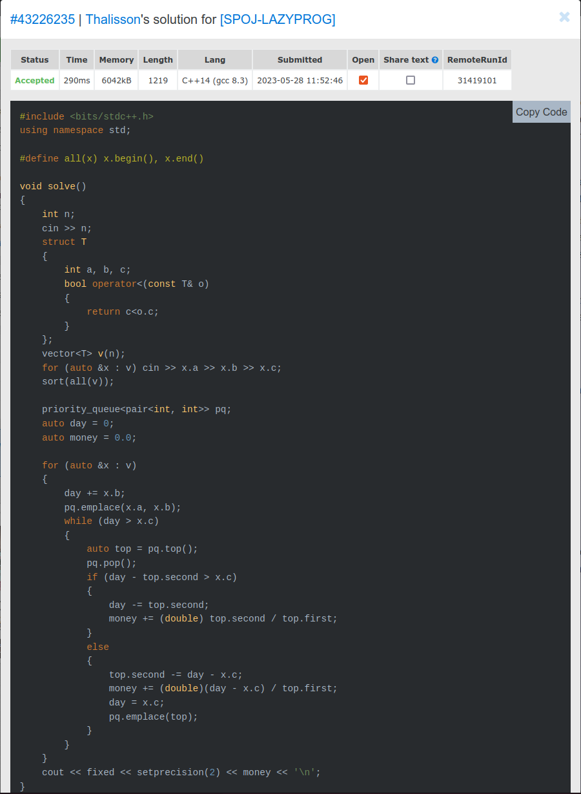

# Greed_Exercícios CP

**Número da Lista**: 43 
**Conteúdo da Disciplina**: Greed 

## Alunos
|Matrícula | Aluno |
| -- | -- |
| 19/0117401  |  Thalisson Alves G. de Jesus |

## Sobre 
Foram selecionados alguns exercícios que abordam o conteúdo visto no módulo de Greed. Cada exercício possui uma pasta com o seu nome e dentro dela há um arquivo com a solução em C++.

## Screenshots

### Exercício 1 - [Positive Array](./Positive-Array/)

### Exercício 2 - [IPC Trainers](./IPC-Trainers/)

### Exercício 3 - [The Lazy Programmer](./The-Lazy-Programmer/)

## Instalação 
**Linguagem**: C++ 
**Framework**: (caso exista) 
**Pré-requisitos**: gcc, g++

## Uso 

Para submeter as soluções siga os passos abaixo.

1. Entre na página do exercício, um link para ela pode ser encontrado no título `README.md` do exercício desejado.
2. Copie o código `solution.cpp` da mesma pasta que o `README.md`.
3. Submeta o código copiado no juiz online.

## Outros 

O vídeo pode ser acessado [aqui](video.mp4).
